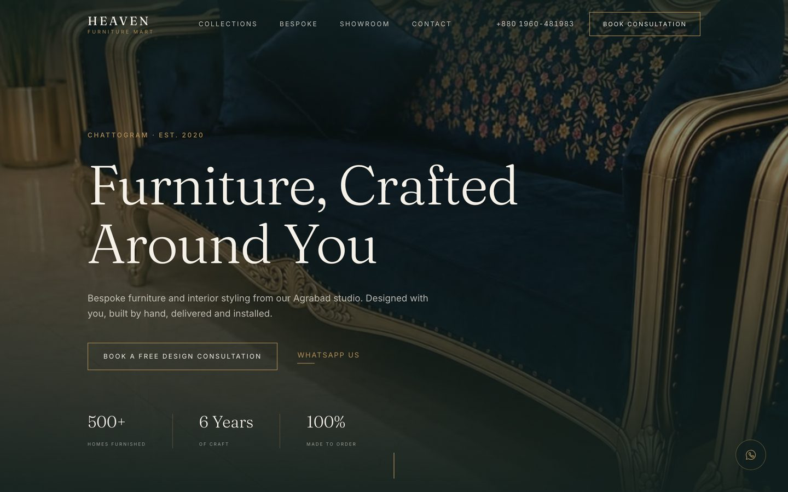

# Heaven Furniture Mart

A conversion-focused landing page for Heaven Furniture Mart, a bespoke furniture house on Agrabad Access Road in Chattogram, Bangladesh.

**Live:** _not deployed yet_



## Tech stack

- Next.js 15 (App Router) with TypeScript
- Tailwind CSS v4, with the palette and type scale defined as tokens in `app/globals.css`
- `next/font` for Fraunces and Inter, self-hosted and preloaded
- `next/image` for every photograph, served as AVIF/WebP
- No CMS, no database, no component library — the components here are hand-built

## Design approach

The page alternates dark and light sections — charcoal-teal hero, warm ivory studio intro, dark editorial list, ivory collections — so the rhythm reads like a printed catalogue rather than a template. The palette is deliberately narrow: ink, ivory, cocoa and a single brass accent that only ever appears as a hairline, an eyebrow label or an underline, never as a fill. Fraunces carries the headlines at genuinely large sizes with tight tracking; Inter does the quiet work in small letterspaced caps. Corners are square, there are no drop shadows, and surfaces are separated by 1px brass hairlines instead.

Bespoke work is what actually distinguishes this business, so it gets its own full-bleed section with the largest type on the page, ahead of any individual product category. Everything on the page resolves to one of two actions: the consultation form, or WhatsApp.

Two notes on the implementation. Brass at its brand value fails WCAG AA as text on ivory, so a deeper cut of the same hue is swapped in on light grounds via a `--brass-contextual` token, and the brand brass stays on dark sections where it passes comfortably. Scroll reveals are hidden only behind `@media (scripting: enabled)`, so the page is fully readable without JavaScript.

## Local setup

```bash
npm install
npm run dev
```

Then open http://localhost:3000.

```bash
npm run build   # production build
npm run start   # serve the production build
npm run lint    # lint app source
```

## Project structure

```
app/
  layout.tsx           fonts, metadata, JSON-LD
  page.tsx             composes the sections in order
  globals.css          design tokens, base styles, utilities
  opengraph-image.tsx  generated 1200x630 share image
  icon.svg             brand mark
components/
  sections/            Header, Hero, TrustStrip, Intro, WhyHeaven, Collections,
                       Bespoke, Process, Milestones, Proof, ContactCTA, QuoteForm, Footer
  ui/                  Container, Eyebrow, SectionHeading, Button, Reveal,
                       FigureImage, HairlineRule, StickyMobileCTA, WhatsAppFab, Icons
lib/
  content.ts           every string on the page
  site.ts              address, phone, email, socials, WhatsApp link builder
public/images/         showroom and product photography
```

`lib/content.ts` is the single source of truth for copy — no strings are hardcoded in JSX.

The quote form has no backend. It validates client-side, then opens WhatsApp with the enquiry prefilled, with a `mailto:` fallback offered alongside it.

`FigureImage` checks that a file exists at build time and falls back to a designed placeholder panel carrying the caption, so a missing photograph never breaks the page.

## Credit

Built for the RACDOX Hackathon. Brand assets © Heaven Furniture Mart.
